# NMEA2000-Relaybox
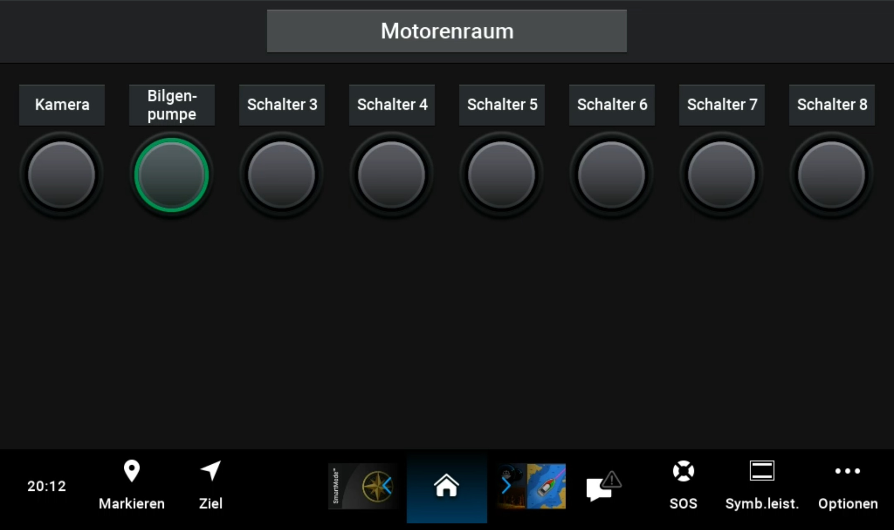

## Table of Contents
- [NMEA2000-Relaybox](#nmea2000-relaybox)
  - [Table of Contents](#table-of-contents)
  - [Description](#description)
  - [Other Sensors](#other-sensors)
  - [Schema](#schema)
  - [NMEA 2000](#nmea-2000)
  - [Librarys](#librarys)
  - [Hardware](#hardware)
    - [ESP32\_Relay\_X2](#esp32_relay_x2)
    - [ESP32\_Relay\_X8](#esp32_relay_x8)
    - [Case](#case)
  - [Configuration](#configuration)
    - [System Configuration](#system-configuration)
      - [Thing name](#thing-name)
      - [AP password](#ap-password)
      - [WiFi SSID](#wifi-ssid)
      - [WiFi password](#wifi-password)
      - [AP offline mode after (minutes)](#ap-offline-mode-after-minutes)
    - [NMEA configuration](#nmea-configuration)
      - [Instance](#instance)
      - [SID](#sid)
      - [Switch Bank Address](#switch-bank-address)
      - [Relay Address](#relay-address)
    - [Relay configuration](#relay-configuration)
      - [GPIO](#gpio)
      - [Off Time (s)](#off-time-s)
  - [Username and password](#username-and-password)
  - [Default IP address](#default-ip-address)
  - [Firmware Update](#firmware-update)
  - [Blinking codes](#blinking-codes)
  - [Reset](#reset)

## Description
The NMEA2000-Relaybox is a versatile device designed to interface with the NMEA2000 network, allowing for the control and monitoring of relays. This project enables seamless integration with marine electronics, providing a reliable solution for managing various electrical components on a vessel.

The relay box supports the following functionalities:
- **Binary Switch Bank Status (PGN 127501)**: This PGN is used to report the status of binary switches, allowing the monitoring of relay states.
- **Switch Bank Control (PGN 127502)**: This PGN is used to control the state of the relays, enabling the activation or deactivation of connected devices.

To ensure compatibility, the plotter must support both PGN 127501 and PGN 127502. This ensures that the relay box can communicate effectively with the plotter, providing real-time status updates and control capabilities.

The device is configurable via a web interface, allowing for easy setup and management. Key configuration options include system settings, NMEA settings, and relay-specific settings such as GPIO pin assignments and off times.

## Other Sensors
 - [Fluid level](https://github.com/minou65/NMEA2000-FluidLevel)
 - [DS1820 Temperatur Monitor](https://github.com/minou65/NMEA2000-DS1820)
 - [BM280 environmental sensor](https://github.com/minou65/NMEA2000-BME280)
 - [Battery monitor](https://github.com/minou65/NMEA2000-BatteryMonitor)

## Schema
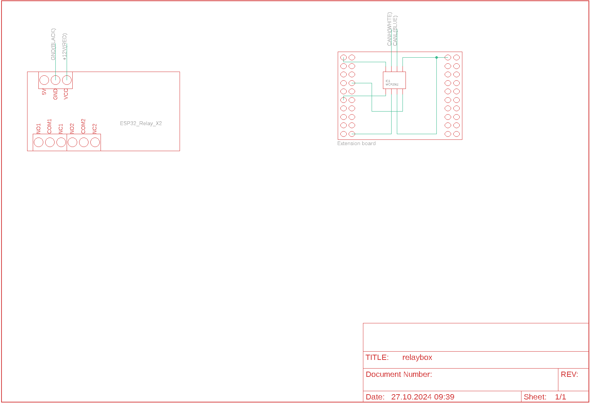

## NMEA 2000
The following PNG's are send
- 127501 - Binary Switch Bank Status
- 127502 - Switch Bank Control

The following PNG will be recived
- 127502 - Switch Bank Control

## Librarys
- [NMEA2000](https://github.com/ttlappalainen/NMEA2000)
- [NMEA200_ESP32](https://github.com/ttlappalainen/NMEA2000_esp32)
- [AsyncTCP (3.2.6)](https://github.com/mathieucarbou/AsyncTCP)
- [ESPAsyncWebServer (3.3.12)](https://github.com/mathieucarbou/ESPAsyncWebServer)
- [Webserial (2.0.7)](https://github.com/ayushsharma82/WebSerial)
- [IotWebConf](https://github.com/minou65/IotWebConf)
- [IotWebConfAsync (1.0.2)](https://github.com/minou65/IotWebConfAsync)
- [IotWebRoot](https://github.com/minou65/IotWebRoot)

__*__ new version and/or new repo

## Hardware
This project uses an ESP32_Relay_X2 or ESP32_Relay_X8 as the base board. An extension with the MCP2562 chip is connected to the expansion pins, enabling CAN bus communication. Power is supplied via the NMEA bus.

The relays can switch a current of up to 10A at a voltage of 30V, providing robust control for various electrical components.

Initial programming must be done using a programmer (e.g., ESP-Prog). The following image shows the pin layout of the expansion pins.

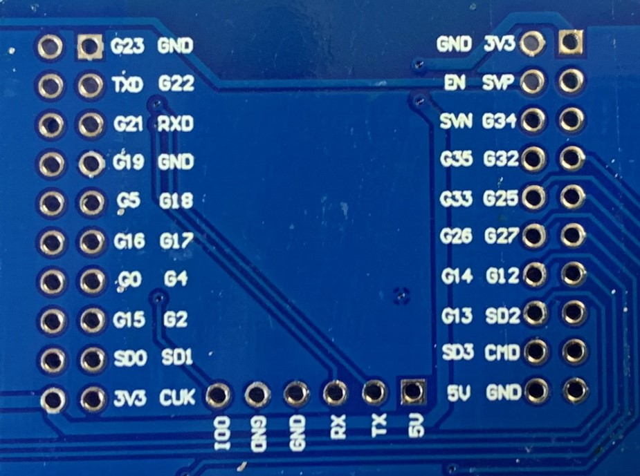

### ESP32_Relay_X2
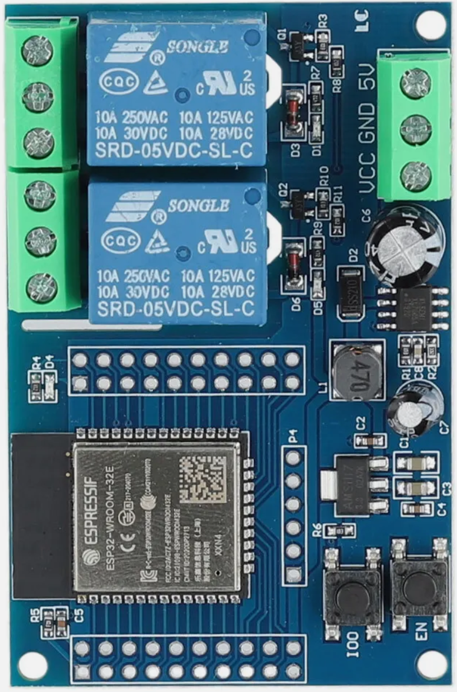

| GPIO | Output |
| --- | --- |
| 16 | Relay 1 | 
| 17 | Relay 2 |
| 23 | internal LED |

### ESP32_Relay_X8
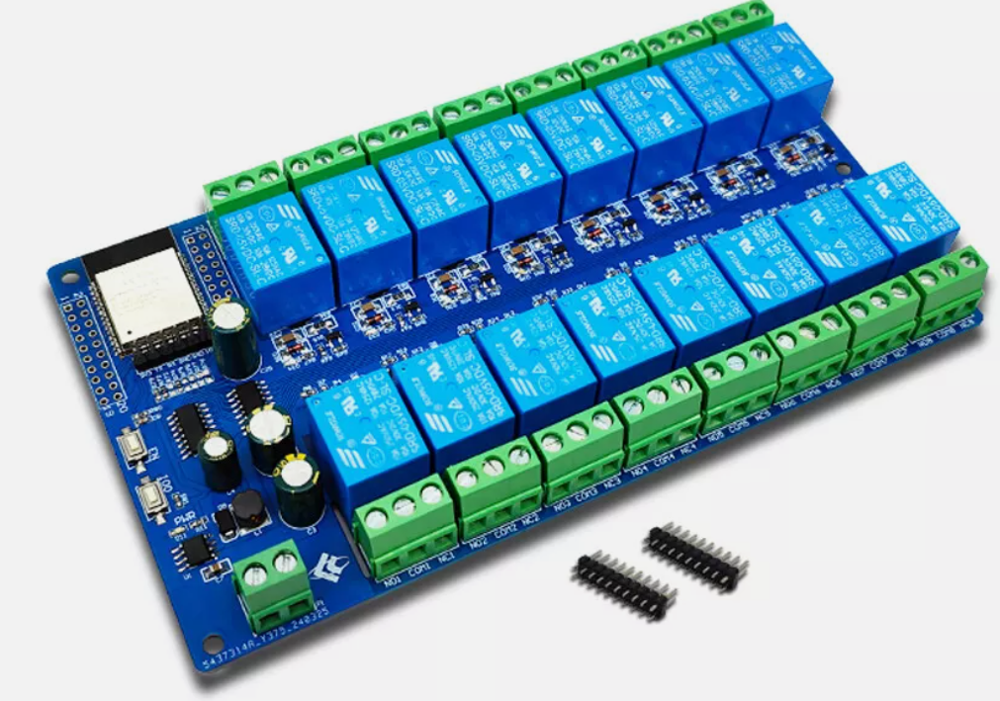

| GPIO | Output |
| --- | --- |
| 32 | Relay 1 | 
| 33 | Relay 2 |
| 25 | Relay 3 | 
| 26 | Relay 4 |
| 27 | Relay 5 | 
| 14 | Relay 6 |
| 12 | Relay 7 | 
| 13 | Relay 8 |
| 23 | internal LED |

### Case
In the `stl` folder, you will find two STL files: one for the case and one for the lid.

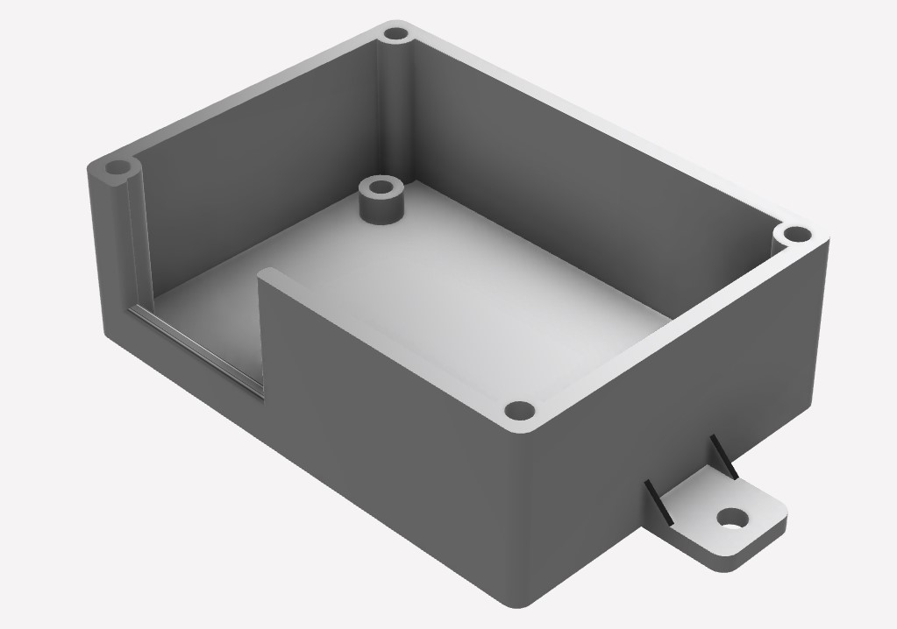 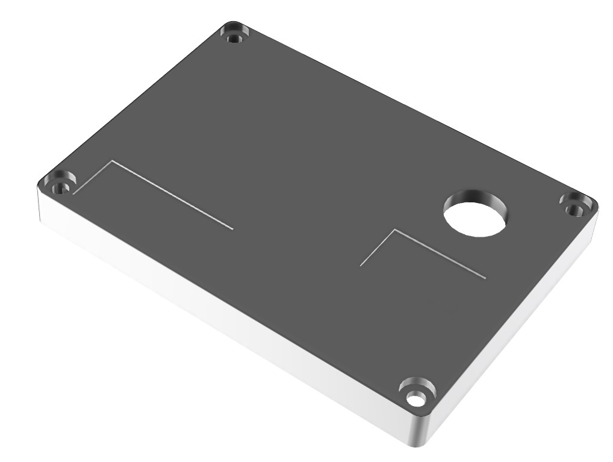

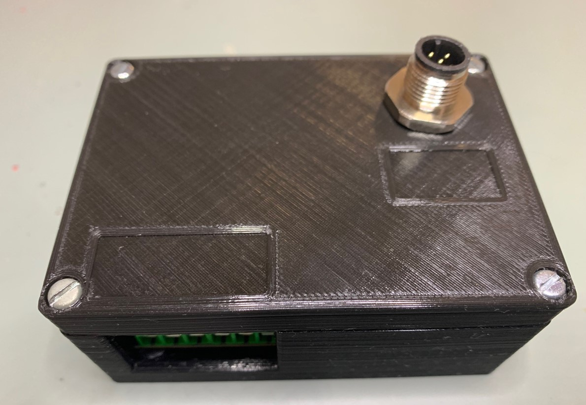 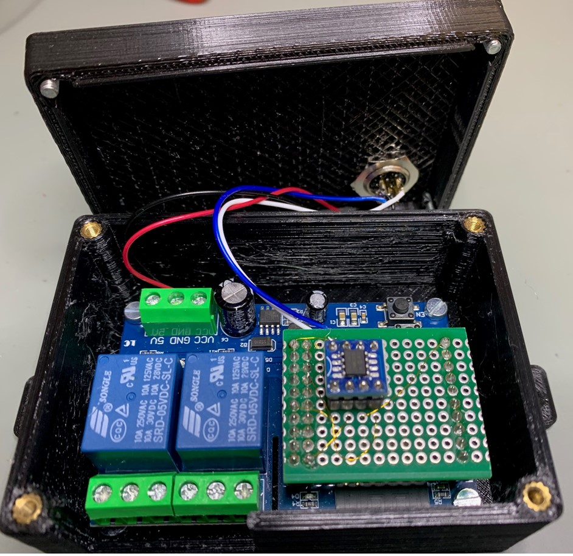

## Configuration
After the first boot, there are some values needs to be set up.
These items are maked with __*__ (star) in the list below.

### System Configuration

#### Thing name
Please change the name of the device to a name you think describes it the most. It is advised to incorporate a location here in case you are planning to set up multiple devices in the same area. You should only use english letters, and the "_" underscore character. Thus, must not use Space, dots, etc. E.g. `relays_enginroom` __*__

#### AP password
This password is used, when you want to access the device later on. You must provide a password with at least 8, at most 32 characters. You are free to use any characters, further more you are encouraged to pick a password at least 12 characters long containing at least 3 character classes. __*__

#### WiFi SSID
The name of the WiFi network you want the device to connect to. __*__

#### WiFi password
The password of the network above. Note, that unsecured passwords are not supported in your protection. __*__

#### AP offline mode after (minutes)
If you don’t plan to connect the sensor to a WiFi network, you don’t need to configure the two options above. If you want to disable the WiFi after a certain time, you can use this option. Specify how long the WiFi should remain enabled after turning on the sensor. Valid values are from 0 to 30 minutes. A value of 0 means that WiFi is always enabled.

### NMEA configuration

#### Instance
This should be unique at least on one device. May be best to have it unique over all devices sending this PGN. __*__

#### SID
Sequence identifier. In most cases you can use just 255 for SID. The sequence identifier field is used to tie different PGNs data together to same sampling or calculation time.

#### Switch Bank Address
The deviswitch bank address is a unique identifier assigned to each device on the NMEA2000 network. This address ensures that each device can communicate without conflicts. You can address up to 254 devices.

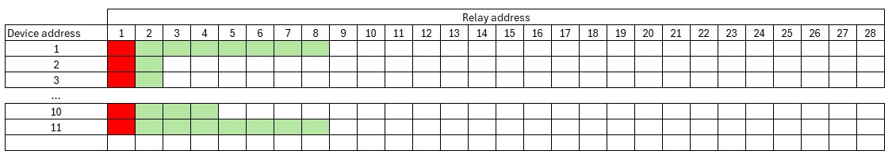

#### Relay Address
The relay address specifies which relay is being controlled by the device. Each relay has a unique address that allows the system to identify and control it individually. Each switch bank can control a maximum of 28 relays.
Normaly the relay address is always 1. In some cases it can make sense that you stretch the switch bank address over more than one relay box. In this case you have to set the correct relay address

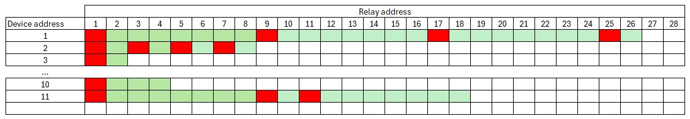

### Relay configuration
#### GPIO
The GPIO pin used for the relay.

#### Off Time (s)
Time is measured in seconds. If the time is set to 0 (default), the relay will remain on indefinitely. Otherwise, the relay will switch off after the specified time has elapsed.

## Username and password
Username is admin. when not connected to an AP the default password is 123456789.

## Default IP address
When in AP mode, the default IP address is 192.168.4.1

## Firmware Update
To update the firmware, navigate to the Configuration page and click on the Firmware Update link. Follow the on-screen instructions to complete the update process.

## Blinking codes
Prevoius chapters were mentioned blinking patterns, now here is a table summarize the menaning of the blink codes.

| Blinking Pattern | Meaning |
| --- | --- |
| Rapid blinking <\br>(mostly on, interrupted by short off periods) | Entered Access Point mode. This means the device creates its own WiFi network. You can connect to the device with your smartphone or WiFi capable computer. |
| Alternating on/off blinking | Trying to connect to the configured WiFi network. |
| Mostly off with occasional short flash | The device is online. |
| Mostly off with occasional long flash | The device is in offline mode |

## Reset
When CONFIG_PIN is pulled to ground on startup, the Thing will use the initial
password to buld an AP. (E.g. in case of lost password)

Reset pin is GPIO 13