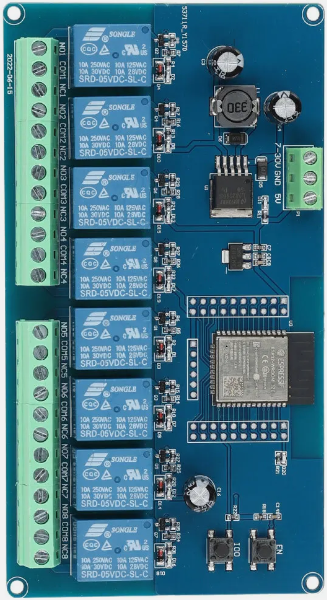
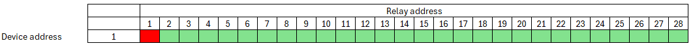
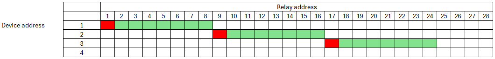
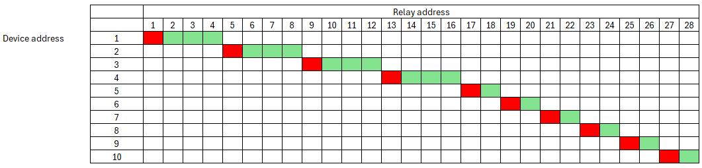

# NMEA2000-Relaybox

# Table of Contents
- [NMEA2000-Relaybox](#nmea2000-relaybox)
- [Table of Contents](#table-of-contents)
- [Description](#description)
- [Schema](#schema)
- [NMEA 2000](#nmea-2000)
  - [Librarys](#librarys)
  - [Outputs](#outputs)
    - [ESP32\_Relay\_X2](#esp32_relay_x2)
    - [ESP32\_Relay\_X8](#esp32_relay_x8)
  - [Configuration](#configuration)
    - [System Configuration](#system-configuration)
      - [Thing name](#thing-name)
      - [AP password](#ap-password)
      - [WiFi SSID](#wifi-ssid)
      - [WiFi password](#wifi-password)
      - [AP offline mode after (minutes)](#ap-offline-mode-after-minutes)
    - [NMEA configuration](#nmea-configuration)
      - [Instance](#instance)
      - [SID](#sid)
  - [Switch Bank Address](#switch-bank-address)
  - [Relay Address](#relay-address)
    - [Relay configuration](#relay-configuration)
      - [GPIO](#gpio)
      - [Off Time (s)](#off-time-s)
  - [Username and password](#username-and-password)
  - [Default IP address](#default-ip-address)
  - [Firmware Update](#firmware-update)
  - [Blinking codes](#blinking-codes)
  - [Reset](#reset)

# Description

# Schema

# NMEA 2000
The following PNG's are send
- 127501 - Binary Switch Bank Status
- 127502 - Switch Bank Control

The following PNG will be recived
- 127502 - Switch Bank Control

## Librarys
- [NMEA2000](https://github.com/ttlappalainen/NMEA2000)
- [NMEA200_ESP32](https://github.com/ttlappalainen/NMEA2000_esp32)
- [AsyncTCP (3.2.6) __"__](https://github.com/mathieucarbou/AsyncTCP)
- [ESPAsyncWebServer (3.3.12) __*__](https://github.com/mathieucarbou/ESPAsyncWebServer)
- [Webserial (2.0.7) __*__](https://github.com/ayushsharma82/WebSerial)
- [IotWebConf](https://github.com/minou65/IotWebConf)
- [IotWebConfAsync (1.0.2) __*__](https://github.com/minou65/IotWebConfAsync)
- [IotWebRoot](https://github.com/minou65/IotWebRoot)

__*__ new version and/or new repo

## Outputs

### ESP32_Relay_X2

| GPIO | Output |
| --- | --- |
| 16 | Relais 1 | 
| 17 | Relais 2 |
| 23 | internal LED |

### ESP32_Relay_X8

| GPIO | Output |
| --- | --- |
| 32 | Relais 1 | 
| 33 | Relais 2 |
| 25 | Relais 3 | 
| 26 | Relais 4 |
| 27 | Relais 5 | 
| 14 | Relais 6 |
| 12 | Relais 7 | 
| 13 | Relais 8 |
| 23 | internal LED |

## Configuration
After the first boot, there are some values needs to be set up.
These items are maked with __*__ (star) in the list below.

### System Configuration

#### Thing name
Please change the name of the device to a name you think describes it the most. It is advised to incorporate a location here in case you are planning to set up multiple devices in the same area. You should only use english letters, and the "_" underscore character. Thus, must not use Space, dots, etc. E.g. `main_cabin` __*__

#### AP password
This password is used, when you want to access the device later on. You must provide a password with at least 8, at most 32 characters. You are free to use any characters, further more you are encouraged to pick a password at least 12 characters long containing at least 3 character classes. __*__

#### WiFi SSID
The name of the WiFi network you want the device to connect to. __*__

#### WiFi password
The password of the network above. Note, that unsecured passwords are not supported in your protection. __*__

#### AP offline mode after (minutes)
If you don’t plan to connect the sensor to a WiFi network, you don’t need to configure the two options above. If you want to disable the WiFi after a certain time, you can use this option. Specify how long the WiFi should remain enabled after turning on the sensor. Valid values are from 0 to 30 minutes. A value of 0 means that WiFi is always enabled.

### NMEA configuration

#### Instance
This should be unique at least on one device. May be best to have it unique over all devices sending this PGN. A total of 5 instances are occupied by the device. Starting with the number set here. __*__

#### SID
Sequence identifier. In most cases you can use just 255 for SID. The sequence identifier field is used to tie different PGNs data together to same sampling or calculation time.

## Switch Bank Address
The device address is a unique identifier assigned to each device on the NMEA2000 network. This address ensures that each device can communicate without conflicts. The device address can be configured in the settings of the relay box.

## Relay Address
The relay address specifies which relay is being controlled by the device. Each relay has a unique address that allows the system to identify and control it individually. This setting is crucial for ensuring that the correct relay is activated or deactivated as needed.

### Relay configuration
#### GPIO
The GPIO pin used for the relay.

#### Off Time (s)
Time is measured in seconds. If the time is set to 0 (default), the relay will remain on indefinitely. Otherwise, the relay will switch off after the specified time has elapsed.

## Username and password
Username is admin. when not connected to an AP the default password is 123456789.

## Default IP address
When in AP mode, the default IP address is 192.168.4.1

## Firmware Update
To update the firmware, navigate to the Configuration page and click on the Firmware Update link. Follow the on-screen instructions to complete the update process.

## Blinking codes
Prevoius chapters were mentioned blinking patterns, now here is a table summarize the menaning of the blink codes.

| Blinking Pattern | Meaning |
| --- | --- |
| Rapid blinking <\br>(mostly on, interrupted by short off periods) | Entered Access Point mode. This means the device creates its own WiFi network. You can connect to the device with your smartphone or WiFi capable computer. |
| Alternating on/off blinking | Trying to connect to the configured WiFi network. |
| Mostly off with occasional short flash | The device is online. |
| Mostly off with occasional long flash | The device is in offline mode |

## Reset
When CONFIG_PIN is pulled to ground on startup, the Thing will use the initial
password to buld an AP. (E.g. in case of lost password)

Reset pin is GPIO 13